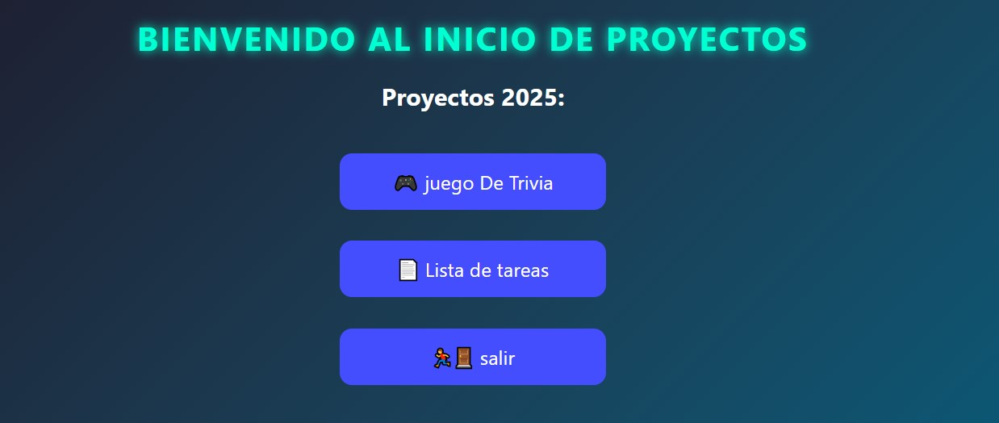

# 📌 Mini Proyectos JavaScript

## Descripción

> Este proyecto es una aplicación web desarrollada con JavaScript, Nodejs y Express que permite a los usuarios observar distintos mini proyectos.

---

### Contenido adicional:

- ✅ Funcionalidades principales
    - Juego de puedra paepel y tijera
    - Lista de tareas pendientes
    - proximamente...
- 🛠️ Tecnologías usadas
    - JavaScript.
    - Nodejs.
    - Express.
    - Motor de Plantillas EJS.
- 🤝 Contribuciones
    - Proximamente...
---
